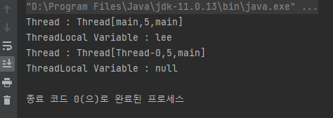
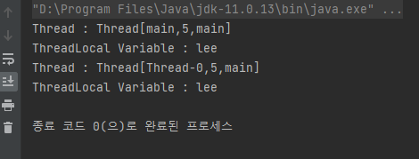
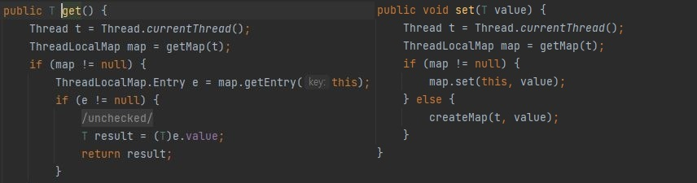

# ThreadLocal이란
## ThreadLocal
- 쓰레드 로컬 변수를 제공하며 이 로컬 변수는 get 또는 set 메서드를 통해 액세스하거나 변경할 수 있으며 쓰레드마다 독립적으로 갖고있는 변수를 뜻한다.
- 즉, ThreadLocal에 할당된 변수는 각 쓰레드마다 고유하게 할당되므로 멀티쓰레드 환경에서 thread-safe 하게 프로그램을 작성할 수 있다. 

### ThreadLocal 예제
```java
package hello.studyjava;

public class Main {

    private static final ThreadLocal<String> THREAD_LOCAL = new ThreadLocal<>();

    public static void main(String[] args) {
        INHERITABLE_THREAD_LOCAL.set("lee");
        System.out.println("Thread : " + Thread.currentThread());
        System.out.println("ThreadLocal Variable : " + THREAD_LOCAL.get());

        Thread thread = new Thread(() -> {
            System.out.println("Thread : " + Thread.currentThread());
            System.out.println("ThreadLocal Variable : " + THREAD_LOCAL.get());
        });
        thread.start();
    }
}
```
- Thread 인스턴스의 정보와 ThreadLocal에 저장된 값을 출력하는 간단한 예제 코드이다.
	- 하나는 main 메서드에서 실행되고 또 하나는 별도의 Thread 인스턴스를 만든 후 그 내부에서 출력하는 코드이다.

<p align="center"></p>

- main 쓰레드에서 ThreadLocal 인스턴스에 "hello"라는 데이터를 저장 후 main 쓰레드에서 ThreadLocal 인스턴스에 저장된 값을 꺼내오면 정상적으로 반환되지만,
	- main 쓰레드에서 생성된 또 하나의 쓰레드에서는 값이 null로 출력되는 걸 확인할 수 있다.
	- 즉, "hello" 라는 데이터는 main 쓰레드 외에 다른 쓰레드에서는 접근할 수 없다.

## InheritableThreadLocal
- ThreadLocal을 확장한 클래스로 상위 쓰레드에서 하위 쓰레드로의 값의 상속을 제공하여 하위 쓰레드가 생성되면 상위 쓰레드에 저장된 값을 상속받아서 사용할 수 있다.
- 일반적으로 하위 쓰레드의 값은 상위 쓰레드와 동일하지만 childValue 메서드를 재정의하여 상위 쓰레드의 값이 아닌 임의의 값을 반환하게끔 할 수 있다.
	- 즉, 상위 쓰레드에 생성된 값을 하위 쓰레드에서 그대로 사용할 수 있고,
	- childValue 메서드를 재정의하여 저장된 변수에 값을 얻어올 때 상위 쓰레드에 저장된 값이 아닌 임의의 값을 반환할 수 있다. 

### InheritableThreadLocal 예제
```java
package hello.studyjava;

public class Main {

    private static final ThreadLocal<String> INHERITABLE_THREAD_LOCAL = new InheritableThreadLocal<>();

    public static void main(String[] args) {
        INHERITABLE_THREAD_LOCAL.set("lee");
        System.out.println("Thread : " + Thread.currentThread());
        System.out.println("ThreadLocal Variable : " + INHERITABLE_THREAD_LOCAL.get());

        Thread thread = new Thread(() -> {
            System.out.println("Thread : " + Thread.currentThread());
            System.out.println("ThreadLocal Variable : " + INHERITABLE_THREAD_LOCAL.get());
        });
        thread.start();
    }
}
```

- 위 코드와 로직은 동일하며 변수의 타입을 ThreadLocal이 아닌 InheritableThreadLocal로 변경하였다.

<p align="center"></p>

- ThreadLocal과는 달리 InheritableThreadLocal에서는 main 쓰레드(상위 쓰레드)에 저장된 값을 하위 쓰레드에서도 정상적으로 값을 얻어온 걸 확인할 수 있다.
	- 즉, 상위 쓰레드에서 생성된 값을 하위 쓰레드에도 공유가 되는 걸 알 수 있다.

### InheritableThreadLocal 예제 (2)
```java
package hello.studyjava;

public class Main {

    public static void main(String[] args) {
        Parent parent = new Parent();
        parent.start();
    }

}

class Parent extends Thread {
    public static final ThreadLocal<String> INHERITABLE_THREAD_LOCAL = new InheritableThreadLocal<>() {
        @Override
        protected String childValue(String parentValue) {
            return "child value";
        }
    };

    @Override
    public void run() {
        INHERITABLE_THREAD_LOCAL.set("parent");

        System.out.println("Thread : " + Thread.currentThread());
        System.out.println("ThreadLocal Variable : " + INHERITABLE_THREAD_LOCAL.get());

        Child child = new Child();
        child.start();
    }
}

class Child extends Thread {

    @Override
    public void run() {
        System.out.println("Thread : " + Thread.currentThread());
        System.out.println("ThreadLocal Variable : " + Parent.INHERITABLE_THREAD_LOCAL.get());
    }
}
```

- 이번에는 childValue 메서드를 재정의하여 하위 쓰레드에서 값을 읽어올 때 상위 쓰레드에 있는 값이 아닌 임의의 값을 얻도록 하였다.

<p align="center"></p>

- 결과는 의도한대로 출력되었다.

## ThreadLocal과 InheritableThreadLocal의 내부 구조
- ThreadLocal과 InheritableThreadLocal은 내부적으로 ThreadLocalMap 이라는 클래스에 key, value로 관리된다.
<p align="center"></p>

- key는 위 코드처럼 현재 실행되고 있는 쓰레드가 key 값이 된다.

## 주의사항
- 예제코드에서는 쓰레드를 직접 생성하고 ThreadLocal에 값을 세팅하여 조회해오는 로직이 있었다.
- 하지만 실무에서는 보통 Spring Framework를 이용해 웹 애플리케이션을 개발할텐데 이 때 ThreadLocal에 저장된 값을 삭제해주지 않으면 의도치 않은 문제가 발생할 수 있다.
	- 클라이언트가 요청을 보내면 쓰레드를 직접 생성하지 않고 미리 ThreadPool에 만들어둔 쓰레드를 가져다 쓰고 반납하기 때문에,
 	- 이전에 처리되었던 쓰레드로부터 생성된 ThreadLocal에 저장된 값이 남아있을 수 있다.
- 그래서 ThreadLocal은 사용 후 바로 삭제해주어야 한다.
	- ThreadLocal.remove() 를 통해 삭제.

 
