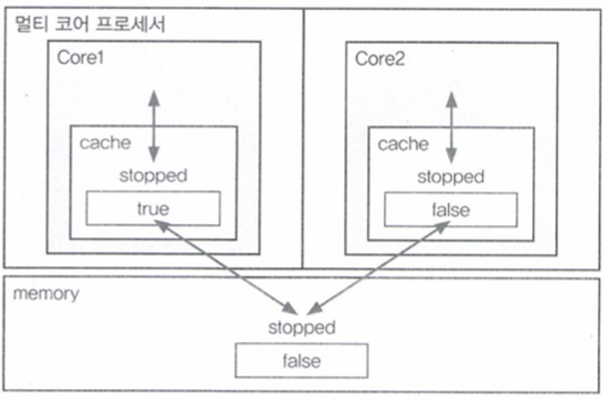
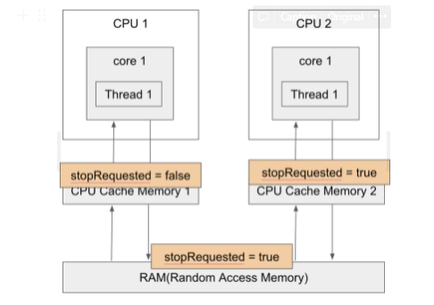
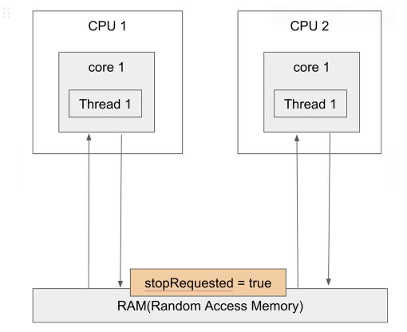

# volatile 키워드

## 개요
<p align="center"></p>

- 멀티 코어 프로세서는 각각의 코어가 별도의 캐시를 가지고 있다. 
- 그리고 각각의 코어는 메모리에서 읽어온 값을 캐시에 저장하고 읽어서 작업을 수행하는데, 같은 값을 다시 읽을 때는 먼저 캐시를 확인 후 없을 때만 메모리에서 읽어온다. 
- 그러다보니 위 그림처럼 코어의 캐시에 저장된 값과 메모리에 저장된 값이 불일치하는 경우가 생길 수 있다. 
  - 이를 가시성 문제라고 한다.
- Java에서는 가시성 문제를 해결하기 위해 volatile 키워드를 사용하게 된다.
  - 이번 글에서는 volatile 키워드를 통해 가시성을 보장하는 방법을 간단한 예시와 함께 알아본다.

 
## 가시성을 보장하지 못한 예제
```java
public class Volatile {

    private static boolean stopRequested;

    public static void main(String[] args) throws InterruptedException {
        Thread backgroundThread = new Thread(() -> {
            int i = 0;
            while (!stopRequested) {
                i++;
            }
        });
        backgroundThread.start();

        Thread.sleep(1000);
        stopRequested = true;
        
    }
}
```

- 메인 스레드가 1초 후 stopRequested 변수를 true로 설정하기 때문에 backgroundThread는 1초 후 반복문을 빠져나올 수 있을 것처럼 보인다.
- 그러나 실제로 실행하면 위 코드는 아래처럼 반복문을 오랜 시간 빠져 나오지 못하거나, 기타 다른 요인이 더 추가되면 영원히 못 나올 수도 있다.

## 가시성 문제가 발생한 원인과 해결 방법
<p align="center"></p>

- CPU 1에서 수행된 스레드를 backgroundThread, CPU 2에서 수행된 스레드를 mainThread라고 하자.
- mainThread는 CPU Cache Memory 2와 RAM에 공유 변수인 stopRequested를 true로 쓰기 작업을 완료하였으나, backgroundThread는 CPU Cache Memory 1에서 읽은 업데이트 되지 않은 stopRequested 값을 사용한다.
  - 해당 값은 false이므로 계속해서 반복문을 수행하게 된다.
  - 즉, mainThread가 수정한 값을 backgroundThread가 언제 보게 될지 보증할 수 없고 이러한 문제를 가시성 문제라고 한다.
- 이 문제를 해결하기 위해서는 stopRequested 변수를 volatile로 선언하면 된다.
  - 그렇게 되면 다음 그림과 같이 CPU Cache Memory를 거치지 않고, RAM으로 직접 읽고 쓰는 작업을 수행하게 된다.

<p align="center"></p>
 
## Volatile을 사용한 코드

```java
public class Volatile {

    private static volatile boolean stopRequested;

    public static void main(String[] args) throws InterruptedException {
        Thread backgroundThread = new Thread(() -> {
            System.out.println("background start : " + System.currentTimeMillis());
            int i = 0;
            while (!stopRequested) {
                i++;
            }
            System.out.println("background end : " + System.currentTimeMillis());
        });
        backgroundThread.start();

        Thread.sleep(1000);
        stopRequested = true;

    }
}
```

```bash
// 출력
background start : 1661412632522
background end : 1661412633526
```

- 코드를 실행하면 1초 후 loop를 빠져나오는 것을 확인할 수 있다.

## 참고
- volatile 키워드는 변수의 작업(읽기/쓰기)를 원자화 하는 것이지 동기화 하는 것은 아니다. 
  - 즉, 동기화가 필요할 때 volatile이 synchronized 블럭을 대체할 수 없다는 의미이다. 

```java
volatile long balance;

synchronized int getBalance() {
		return balance;
}

synchronized void withdraw(int money){
		if(balance >= money) {
				balance -= money;
		}
}
```
- balance 변수가 volatile로 작업을 원자화했으니 getBalance의 synchronized 키워드가 불필요해 보일 수 있다.
- 하지만 해당 키워드로 동기화를 하지 않을 경우 특정 스레드에서 withdraw()가 호출되어 lock이 걸리고 로직이 처리되는 중에도 getBalance()가 호출이 가능해질 수 있다. 

### 참고 - synchronized
- synchronized를 사용해도 volatile과 동일한 효과를 얻을 수 있다. 
- 스레드가 synchronized 블럭으로 들어갈 때와 나올 때, 캐시와 메모리 간의 동기화가 이뤄지면서 값의 불일치가 해소되기 때문이다. 

### 참고 - volatile로 long과 double 원자화
- JVM은 데이터를 4Byte 단위로 처리하기에 int와 int보다 작은 타입들은 한 번에 읽고 쓸 수 있다.
  - 이 말은 하나의 명령어로 읽기/쓰기가 가능하다는 의미인데, 그럼 4Byte 이상인 타입은 어떻게 해야 할까? 
- long이나 double과 같이 크기가 8Byte인 변수는 하나의 명령어로 읽기/쓰기를 할 수 없기 때문에 변수의 값을 읽는 과정에 다른 스레드가 끼어들 수 있다.
  - 이 때, volatile을 사용하면 된다.
  - volatile은 해당 변수에 대한 읽기/쓰기를 원자화 하는데, 이는 작업을 더 이상 나눌 수 없게 한다는 의미가 되고 작업 중간에 다른 스레드에서 끼어들 수 없게 된다는 의미가 된다. 
