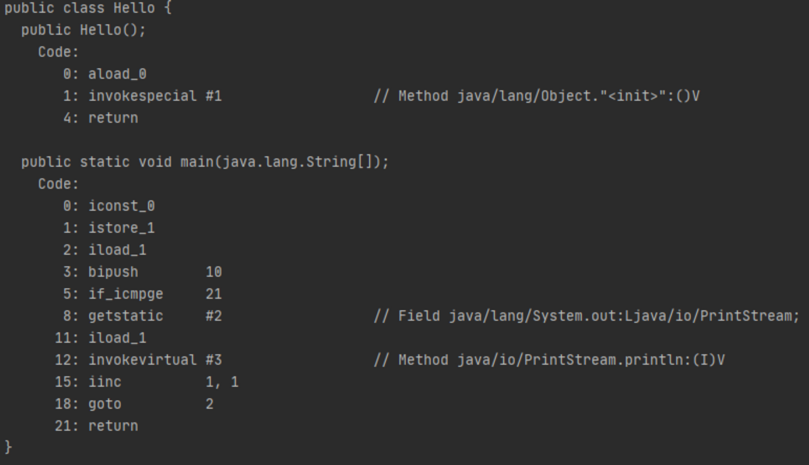
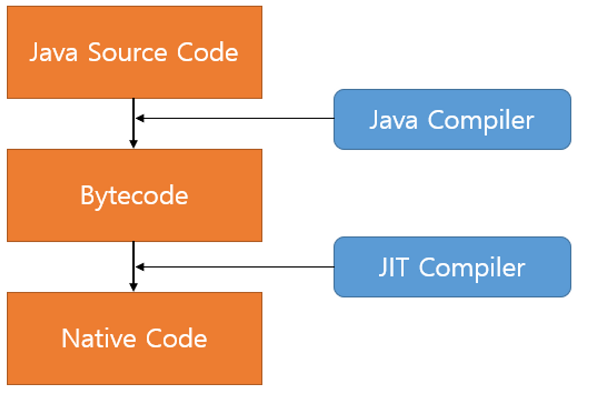
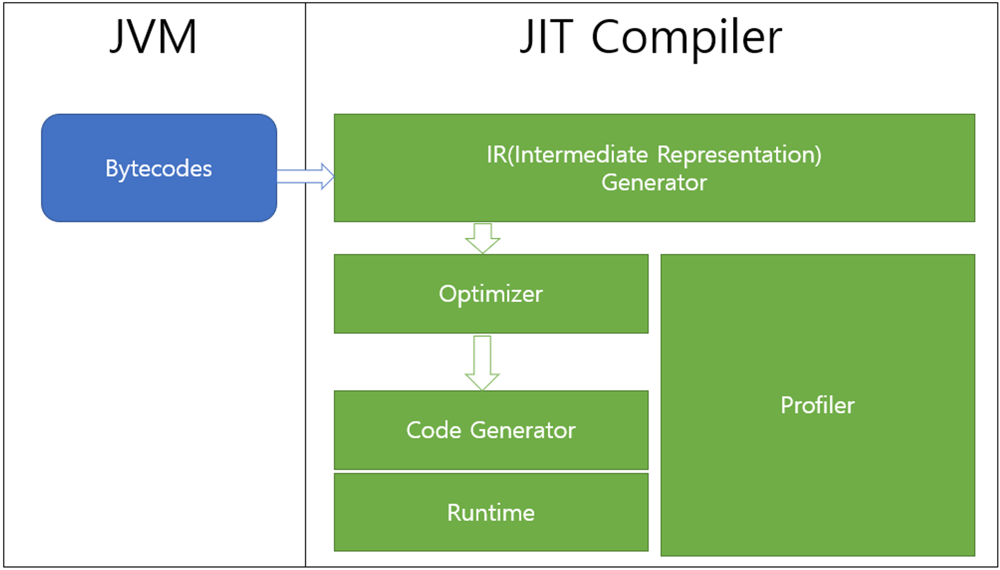
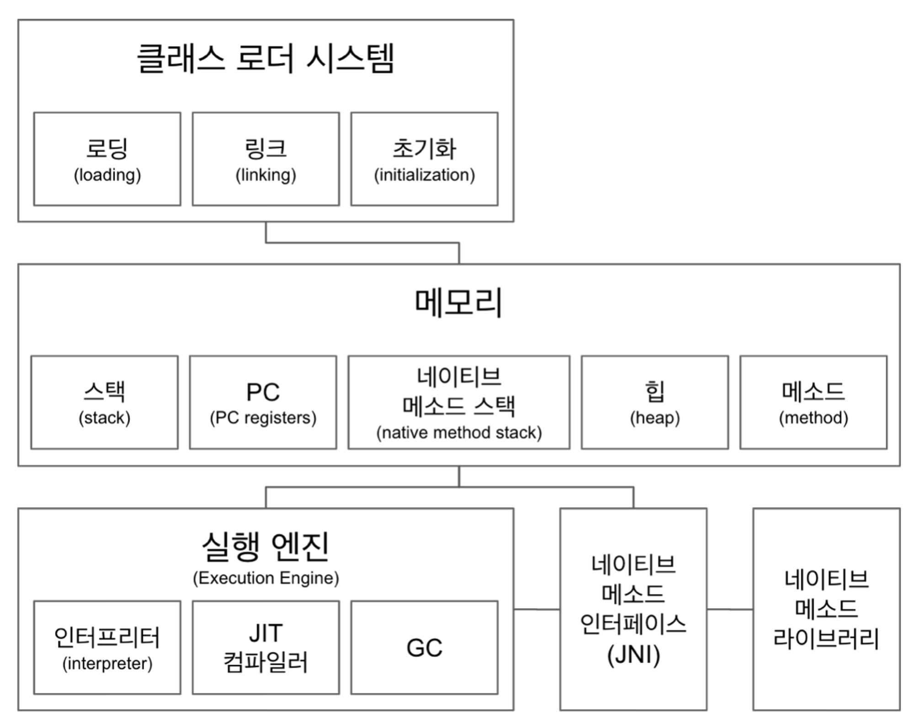
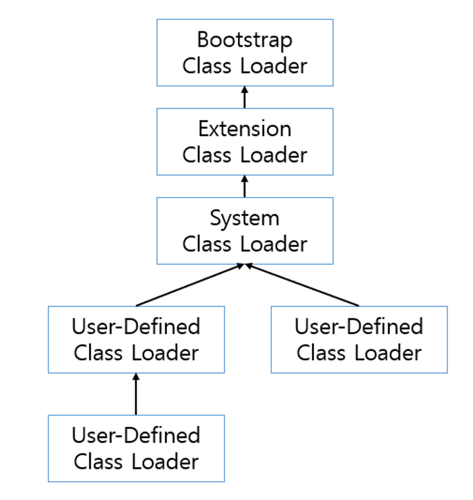

# JVM과 Java의 실행

## 0. 학습할 것
1. JVM이란 무엇인가
2. 컴파일 방법
3. 실행 방법
4. 바이트코드란 무엇인가
5. JIT 컴파일러란 무엇이며 어떻게 동작하는지
6. JVM 구성 요소
7. JDK와 JRE의 차이

## 1. JVM이란 무엇인가
> Java Virtual Machine, 자바를 실행하기 위한 가상 기계
- 가상 기계 : 소프트웨어로 구현된 하드웨어를 뜻하는 넓은 의미의 용어
- 자바 가상 머신으로 자바 바이트코드(.class 파일)를 OS에 특화된 코드로 변환하여 실행한다.

### 어째서 변환하는가
- 일반 애플리케이션의 코드는 OS만 거치고 하드웨어로 전달되는데, Java 애플리케이션은 JVM을 한 번 더 거칠뿐 아니라 하드웨어에 맞게 완전히 컴파일 된 상태가 아니라 실행 시 해석(interpret)되기 때문에 속도가 느리다는 단점이 있다. 
  - 하지만, 요즘에는 바이트코드(컴파일된 자바코드)를 하드웨어의 기계어로 바로 변환해주는 JIT 컴파일러와 향상된 최적화 기술이 적용되어 속도의 격차를 많이 줄였다.
- 또한, JVM이 없을 경우 애플리케이션은 OS와 바로 맞붙어 있기 때문에 OS에 종속적이게 된다. 
  - 그래서 다른 OS에 실행시키기 위해서는 애플리케이션을 그 OS에 맞게 변경해야 한다.
  - 하지만 이처럼 JVM을 사용하는 Java 애플리케이션은 JVM과만 상호작용을 하므로 OS에 구애받지 않고 실행이 가능하다. 

### 특징
1. 스택 기반의 가상 머신 : 인텔x86 아키텍처나 ARM 아키텍처와 같은 하드웨어가 레지스터 기반으로 동작하는데 비해 JVM은 스택 기반으로 동작한다.
2. 심볼릭 레퍼런스 : 기본 자료형(primitive data type)을 제외한 모든 타입(클래스와 인터페이스)을 명시적인 메모리 주소 기반의 레퍼런스가 아니라 심볼릭 레퍼런스를 통해 참조한다.
    > 심볼릭 레퍼런스: 참고하는 클래스의 특정 메모리 주소를 참조 관계로 구성하지 않고 이름만 가지고 있는 것.
3. 가비지 컬렉션(garbage collection) : 클래스 인스턴스는 사용자 코드에 의해 명시적으로 생성되고 가비지 컬렉션에 의해 자동으로 파괴된다.
4. 기본 자료형을 명확하게 정의하여 플랫폼 독립성 보장 : C/C++등의 전통적인 언어는 플랫폼에 따라 int형의 크기가 변하지만 JVM은 기본 자료형을 명확하게 정의하여 호환성을 유지하고 플랫폼 독립성을 보장한다. 
5. 네트워크 바이트 오더(network byte order): 자바 클래스 파일은 네트워크 바이트 오더를 사용한다. 인텔 x86 아키텍처가 사용하는 리틀 엔디안이나, RISC계열 아키텍처가 주로 사용하는 빅 엔디안 사이에서 플랫폼 독립성을 유지하려면 고정된 바이트 오더를 유지해야 하기에 네트워크 전송 시에 사용하는 바이트 오더인 네트워크 바이트 오더를 사용한다. 네트워크 바이트 오더는 빅 엔디안이다.

## 2. 컴파일 방법
- 플랫폼으로부터 독립적인 언어인 Java는 바로 컴파일을 할 수는 없다.
- 대신, 두 단계를 거쳐 컴파일할 수 있는데
1. OS에서 독립적인 컴파일러를 통해서
2. 모든 운영체제에 맞게 만들어진 JVM으로 컴파일 할 수 있다.

### JVM 컴파일 과정
- *.java 파일이 컴파일러를 통해 전달된 다음 소스코드를 Bytecode로 인코딩한다.
- 소스파일에 포함된 각 클래스의 내용은 별도의 .class 파일에 저장된다. 소스코드를 바이트 코드로 변환하는 동안 컴파일러는 다음 단계를 따른다. 
  - 1️⃣ Parse: *.java 소스파일을 읽은 뒤 결과 토큰을 AST(Abastract Syntax Tree) 노드에 매핑한다. 
  - 2️⃣ Enter:  정의된 심볼들을 심볼테이블(Symbol table) 에 저장한다. 
  - 3️⃣ Process annotations: 요청된 경우 지정된 컴파일 위치에서 찾은 애너테이션을 처리한다.
  - 4️⃣ Attribute: 구문 트리에 속성을 부여하며, 이름 확인, 유형 검사 및 상수 정의가 포함된다.
  - 5️⃣ Flow: 이전 단계의 트리에 대한 데이터 흐름을 분석한다. 여기에 할당 및 도달 가능성에 대한 검사도 포함된다. 
  - 6️⃣ Desugar: AST를 다시 작성하고 몇몇 syntactic sugar 들을 번역한다.
  - 7️⃣ Generate: *.class 파일을 생성한다.

- 해당 컴파일은 javac 파일명.java 명령어로 이루어진다.

## 3. 실행 방법
- 이전 컴파일 과정에서 생성한 .class 파일을 java 명령어(java 파일명)로 실행시킨다.

## 4. 바이트코드란 무엇인가
- 특정 하드웨어가 아닌 가상 컴퓨터(Virtual Machine)에서 돌아가는 실행 프로그램을 위한 이진 표현법으로 하드웨어가 아닌 소프트웨어에 의해 처리되기에 기계어보다 추상적이다.

### 자바 바이트코드(Java bytecode) 
- JVM이 실행하는 명령어의 형태로 각각의 바이트코드는 1바이트로 구성되지만 몇 개의 파라미터가 사용되는 경우가 있어 총 몇 바이트로 구성되는 경우가 있다.
  - 여기서, 각각의 바이트코드란 opcode (연산 코드)를 가리킨다. 0~255로 표현된다.

### 자바코드를 바이트코드로 변환
```java
public class Hello {
    public static void main(String[] args) {
        for (int i = 0; i < 10; i++) {
            System.out.println(i);
        }
    }
}
```
- 위 자바 코드를 자바 컴파일러를 통해 아래와 같은 바이트코드로 번역한다.
<p align="center"></p>


## 5. JIT 컴파일러란 무엇이며 어떻게 동작하는지
- 자바 바이트코드는 기계가 바로 수행할 수 있는 언어보다는 비교적 인간이 보기 편한 형태로 기술된 것으로,
  - 실행 엔진은 이와 같은 바이트코드를 JVM 내부에서 기계가 실행할 수 있는 형태로 변경하는데,
  - 이 때 인터프리터, JIT 컴파일러를 사용한다.

### JIT 컴파일러란
- JIT(Just-In-Time) 컴파일러는 인터프리터의 단점을 보완하기 위해 도입되었다.
- 인터프리터 방식으로 실행하다 적절한 시점에 바이트코드 전체를 네이티브 코드로 바꾼다.
  - 그 다음부터 인터프리터는 네이티브 코드로 컴파일된 코드를 바로 사용한다.
  - 네이티브 코드를 실행하는 것이 하나씩 인터프리팅 하는 것보다 빠르고, 네이티브 코드는 캐시에 보관하기 때문에 한 번 컴파일된 코드는 계속 빠르게 수행된다.
- 그러나 JIT 컴파일러가 컴파일하는 과정은 바이트코드를 하나씩 인터프리팅하는 것보다 훨씬 오래 걸린다.
  - 만약, 한 번만 실행되는 코드라면 컴파일하지 않고 인터프리팅하는게 유리하다.
  - 따라서 JIT 컴파일러를 사용하는 JVM은 내부에서 해당 메소드의 수행 빈도를 확인 후 일정 정도를 넘을 때 컴파일을 수행한다. 

<p align="center"></p>

#### JIT 컴파일러 동작 형태
<p align="center"></p>

- JIT 컴파일러는 바이트코드를 우선 중간 단계의 표현인 IR(Intermediate Representation)로 변환하여 최적화를 수행하고 그 다음 네이티브 코드를 생성한다.
  - IR : 소스 코드를 표현하기 위해 컴파일러 또는 가상 시스템에서 내부적으로 사용하는 데이터 구조 또는 코드로 최적화와 번역 등 추가처리를 위해 도움이 되도록 설계되었다.

## 6. JVM 구성 요소
<p align="center"></p>

- 클래스 로더(Class Loader)가 컴파일된 자바 바이트 코드를 메모리 영역에 로드하고, 실행 엔진(Execution Engine)이 자바 바이트코드를 실행한다.

### 클래스 로더 시스템
- 자바는 런타임에 클래스를 처음으로 참조할 때 해당 클래스를 로드하고 링크하는 특징이 있다.
  - 이 동적 로드를 담당하는 부분이 JVM의 클래스 로더이다. 

#### 클래스 로더의 특징
<p align="center"></p>

- __계층 구조__
  - 클래스 로더끼리 부모-자식 관계를 이뤄 계층 구조로 생성된다.
  - 여기서 최상위 클래스 로더는 부트스트랩 클래스 로더(Bootstrap Class Loader)이다.
- __위임 모델__
  - 계층 구조를 바탕으로 클래스 로더끼리 로드를 위임하는 구조로 동작한다.
  - 클래스를 로드할 때 먼저 상위 클래스 로더를 확인하여 상위 클래스 로더에 있다면 해당 클래스를 사용하고 없다면 로드를 요청받은 클래스 로더가 클래스를 로드한다. 
- __가시성(visiblility)제한__
  - 하위 클래스 로더는 상위 클래스 로더를 찾을 수 있지만 상위 클래스 로더는 하위 클래스 로더를 찾을 수 없다.
- __언로드 불가__
  - 클래스 로더는 클래스를 로드할 수는 있지만 언로드할 수는 없다.
  - 언로드 대신, 현재 클래스 로더를 새로 삭제하고 아예 새로운 클래스 로더를 생성하는 방법을 사용할 수 있다.

#### 클래스 로더 위임 모델 
- Bootstrap Class Loader
  - JVM 시작 시 가장 최초로 실행되는 클래스 로더
  - Java 클래스를 로드하는 것이 아닌, Java 클래스를 로드할 수 있도록 하는 자바 자체의 클래스 로더와 최소한의 자바 클래스(java.lang.Object / Class / ClassLoader)만을 로드
- Extension Class Loader
  - 확장 자바 클래스들을 로드
  - java.ext.dirs 환경 변수에 설정된 디렉토리의 클래스 파일을 로드하고, 이 값이 설정되어 있지 않은 경우 $JAVA_HOME/jar/lib/ext 에 있는 클래스 파일 로드
- Application Class Loader
  - 자바 프로그램 실행 시 지정한 Classpath에 있는 클래스 파일 혹은 jar에 속한 클래스 로드
  - 개발자가 애플리케이션 구동을 위해 직접 작성한 대부분의 코드가 해당 클래스 로더에 의해 로드된다.
- User-Defined Class Loader
  - 애플리케이션 사용자가 직접 코드 상에서 생성해서 사용하는 클래스 로더

#### 클래스 파일이 거치는 단계
- 컴파일러에 의해 생성된 클래스 파일은 시스템 또는 OS와 독립적이기에 모든 시스템에서 실행이 가능하다.
- 실행을 위해 기본 클래스 파일(main 메소드를 포함하는 클래스)이 JVM으로 전달된 다음 최종 코드가 실행되기 전 주요 3가지 단계를 거친다. 

##### 1) 로딩
- 클래스 로더가 .class 파일을 읽고 그 내용에 따라 적절한 바이너리 데이터를 만들어 메소드 영역에 저장
- 이 때 메소드 영역에 저장하는 데이터는 다음과 같다.
  - FQCN(Fully Quallified Class Name)
  - 클래스 | 인터페이스 | 이넘(Enum)
  - 메소드와 변수
- 로딩이 끝나면 해당 클래스 타입의 Class 객체를 생성하여 힙(heap)영역에 저장

##### 2) 링크
- Verify, Prepare, Resolve(Option) 세 단계로 나뉜다.
  - 검증(Verify): .class 파일 형식이 유효한지 체크한다.
  - 준비(Preparation): 클래스 변수(static 변수)와 기본값이 필요한 메모리 준비
  - Resolve: 심볼릭 메모리 레퍼런스를 메모리 영역에 있는 실제 레퍼런스로 교체한다.

##### 3) 초기화
- static 변수의 값을 할당한다. (static block이 있다면 이 때 실행된다.)

### 메모리
- JVM의 메모리 영역으로 자바 애플리케이션을 실행할 때 사용되는 데이터들을 적재하는 영역이다.

#### 스택 영역 
- 지역 변수, 파라미터, 리턴 값, 연산에 사용되는 임시 값 등이 생성되는 영역으로 클래스 수준의 정보를 저장하고 공유 자원이다.
```java
int a = 10;
```
- 위와 같은 코드를 작성했다면, a라는 메모리 영역을 잡고 해당 영역에 10을 할당한다.
- 즉, 스택에 a라는 이름의 값이 10인 메모리 공간을 만든다.

#### PC Register 
- 쓰레드가 생성될 때마다 생성되는 영역으로 현재 쓰레드가 실행되는 부분의 주소와 명령을 저장하고 있는 영역이다.
- 이것을 이용해 쓰레드를 돌아가며 수행할 수 있게 한다.

#### 네이티브 메소드 스택
- 자바 외 언어로 작성된 네이티브 코드를 위한 메모리 영역으로 보통 C/C++등의 코드를 수행하기 위한 스택이다. (JNI)

#### 힙(heap)
- new 키워드로 생성된 객체와 배열이 생성되는 영역이다.
- 메소드 영역에 로드된 클래스만 생성이 가능하고 Garbage Collector가 참조되지 않는 메모리를 확인/제거하는 영역이다. 
- 위에서 설명했듯이 클래스 수준의 정보는 스택에 저장되지만 객체의 인스턴스는 힙 영역에 생성된다.
  - 그리고 스택 영역에는 힙 영역의 주소값을 저장한다. 

#### 메소드 영역
- 모든 스레드가 공유하는 영역으로 JVM이 시작될 때 생성된다.
- 저장하는 내용은 JVM 이 읽어들인 것들로 다음과 같다.
  - 각각의 클래스
  - 인터페이스에 대한 런타임 상수 풀
  - 필드와 메서드 정보
  - static 변수
  - 메서드의 바이트코드

### 실행 엔진(Execution Engine)
- 클래스 로더에 의해 메모리에 적재된 클래스(Bytecodes)들을 기계어로 변경해 명령어 단위로 실행하는 역할을 한다.
- 명령어를 실행하는 방식은 다음과 같이 두 가지가 있다.
  - 인터프리터(Interpreter)
  - JIT(Just-In-Time) 컴파일러
- 그리고 더 이상 참조되지 않는 객체를 모아서 정리하는 GC(Garbage Collector)가 있다. GC는 상황에 맞는 적절한 GC를 사용한다.

### JNI(Java Native Interface)
> 네이티브 메소드 인터페이스 & 라이브러리
- Java 언어 자체로 해결이 안되는 경우 대처할 수 있는 방법 중 하나이다. 
  - Ex) Database 조회의 속도 성능 향상을 위해서 C/C++ 라이브러리 사용이 필요한 경우
- 자바 애플리케이션에서 C, C++, 어셈블리로 작성된 함수를 사용할 수 있는 방법을 제시한다.
- Native Keyword를 사용한 메소드 호출

## 7. JDK와 JRE의 차이
### JRE(Java Runtime Enviroment): JVM + 라이브러리
- 자바 애플리케이션을 실행할 수 있도록 구성된 배포판.
- JVM과 핵심 라이브러리 및 자바 런타임 환경에서 사용하는 프로퍼티 세팅이나 리소스 파일을 가지고 있다. 
- 개발 관련 도구는 포함하지 않는다. (JDK에서 제공)
### JDK(Java Development Kit): JRE + 개발 툴
- JRE + 개발에 필요한 툴
- 소스 코드를 작성할 때 사용하는 자바 언어는 플랫폼에 독립적
- 오라클은 자바 11부터는 JDK만 제공하며 JRE를 따로 제공하지 않는다.
