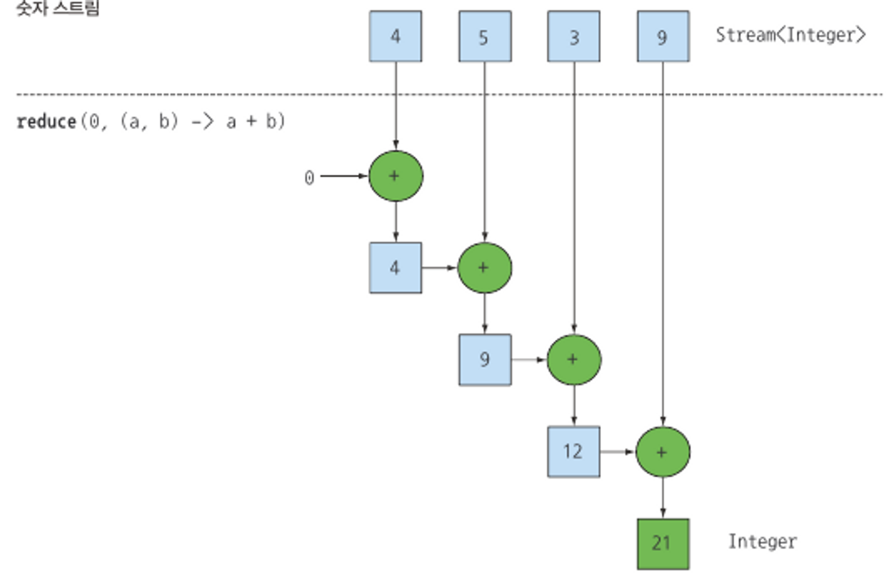

# 스트림 (Stream)
## 1. Stream 소개
- 연속된 데이터를 처리하는 오퍼레이션들의 모음

### 컨베이어 벨트
- stream은 컨베이어 벨트와 비슷하다.
- 컨베이어 벨트에 떡 조각(데이터)들을 흘려보내면서 반죽을 하고, 앙금을 쌓고(map), 불량품은 빼고(filter), 포장을 해서(collect) 내보낸다. 

### 특징
- 데이터를 담고 있는 저장소(컬렉션)가 아니다.
- stream은 처리하는 데이터 소스를 변경하지 않는다. 즉, 내가 A라는 데이터를 수정한다고 해서 원본 데이터가 수정되는 것은 아니다. 

```java
public static void main(String[] args) {
    List<String> names = new ArrayList<>();
    names.add("hansol");

    Stream<String> stringStream = names.stream().map(String::toUpperCase);
    names.forEach(System.out::println);
}
/*
[실행 결과]
hansol
*/
```

- 스트림으로 처리하는 데이터는 오직 한 번만 처리한다.
  - 컨베이어 벨트에서 데이터들이 한 번 지나간뒤 다시 돌아오지 않습니다. 
- 무제한의 데이터일 수 있다. 
  - 이 경우 Short Circuit 메소드를 사용해서 제한할 수 있다. 
- 중개 오퍼레이션은 근본적으로 lazy하다
  - 여러 중개 오퍼레이션들을 메소드 체이닝을 하더라도 그 시점에서 코드가 수행되지 않는다.
  - 모든 중개 오퍼레이션의 실행 시기는 종료 오퍼레이션의 호출 시점이다.
  - 그렇기에 중개 오퍼레이션의 반환타입은 또 다른 stream 이다. 

```java
public static void main(String[] args) {
    List<String> names = new ArrayList<>();
    names.add("hansol");
    names.add("toby");
    names.add("catsbi");
    names.add("mijeong");

    Stream<String> stringStream = names.stream().map(s->{
        System.out.println(s);
        return s.toUpperCase();
    });
    names.forEach(System.out::println);
}
```

#### names.stream().map(s->{ ... });

- stream의 중개 오퍼레이터를 사용하는 순간에는 코드가 수행되지 않는다.
  - 그렇기 때문에 중개 오퍼레이션 map 안에 있는 출력문이 수행되지 않는다.
  - 수행시키기 위해서는 스트림 파이프라인을 정의해야 한다. (중간 처리 과정은 최종 처리 전까지 수행되지 않음)
---

- 손쉽게 병렬 처리를 할 수 있다.
  - 지금껏 구현한 대부분의 예제 코드에서는 forEach를 통해 단순한 반복 출력만 했다.
  - 여기서 조건문이 추가되고 로직이 추가될수록 stream을 통해 구현할수록 간결해지기 때문에 stream을 쓰는 것 외에도 기본적인 for문이나 for-of문으로는 로직들을 병렬적으로 처리하는게 쉽지 않다.
  - 하지만, parallelStream()을 이용하면 손쉽게 병렬처리를 할 수 있다.

```java
public static void main(String[] args) {
    List<String> names = new ArrayList<>();
    names.add("hansol");
    names.add("toby");
    names.add("catsbi");
    names.add("mijeong");

    List<String> collect = names.parallelStream().map(s->{
        System.out.println(s + " " + Thread.currentThread().getName());
        return s.toUpperCase();
    }).collect(Collectors.toList());

    collect.forEach(System.out::println);
}
```
- 주의해야할 점은 사실상 멀티 스레드를 이용한다고 성능이 무조건 좋은것은 아니며 오히려 느려질 가능성이 더 높다.
- 대부분의 경우 그냥 stream을 쓰는게 나으며 정말 큰 데이터를 다룰 때 성능 테스트 후 parallelStream()을 사용한다.

### 스트림 파이프라인
- 스트림이라는 컨베이어 벨트에 0개 혹은 다수의 중개 오퍼레이터(intermediate operation)과 한 개의 종료 오퍼레이션(terminal operation)으로 구성한다.
- 해당 스트림은 반드시 하나의 종료 오퍼레이션이 있어야 하며, 만약 종료 오퍼레이션이 없다면 스트림은 존재하지만 코드 수행은 되지 않습니다. 
- 스트림의 데이터 소스는 오직 종료 오퍼레이션을 실행할 때에만 처리한다. (위에서 보았던 lazy 특성)

#### 중개 오퍼레이션
- Stream을 리턴한다.
- Stateless/Stateful 오퍼레이션으로 더 상세하게 구분할 수도 있습니다.
  - 대부분 Stateless지만 distinct나 sorted처럼 이전 소스 데이터를 참조해야 하는 오퍼레이션은 Stateful 오퍼레이션입니다. 
filter, map, limit, skip, sorted, ...

#### 종료 오퍼레이션
- Stream을 리턴하지 않는다.
- collect, allmatch, count, forEach, min, max...

```java
public static void main(String[] args) {
        List<String> names = new ArrayList<>();
        names.add("hansol");
        names.add("toby");
        names.add("catsbi");
        names.add("mijeong");

        List<String> collect = names.stream().map(s -> {
            System.out.println(s);
            return s.toUpperCase();
        }).collect(Collectors.toList());
        collect.forEach(System.out::println);
    }
```

## 2. Stream API
### 1. 걸러내기
- Filter(Predicate)
- stream에서 특정 조건(Predicate)을 만족하는 요소만 새로운 스트림으로 반환
### 2. 변경하기
- Map(Function) 또는 FlatMap(Function)
- 각각의 요소에서 특정 요소만 꺼내거나 혹은 변경하여 새로운 스트림으로 반환
- flatMap의 경우 Array나 Object로 래핑된 내용물을 꺼내어 하나로 합친 스트림으로 생성 후 반환

### 3. 생성하기 
- generate(Supplier) 또는 Iterator(T seed, UnaryOperator)
- seed로부터 UnaryOperator을 무제한으로 반복하는 스트림 반환

### 4. 스트림에 있는 데이터가 특정 조건을 만족하는지 확인
- anyMatch(), allMatch(), nonMatch()
- 스트림의 요소를 돌며 특정 조건을 만족하는지 확인
	- Ex1) 스트림에 있는 모든 값이 10보다 작은지 확인 (allMatch)
	- Ex2) 스트림의 제목 중 "Test"가 들어가는 제목이 있는지 확인 (anyMatch)

### 5. 개수 세기
- count()
- Ex) 10보다 작은 수의 개수를 센다.

### 6. 스트림을 데이터 하나로 뭉치기
- reduce(identity, ByFunction), collect(), sum(), max()
	- Ex1) 모든 숫자 합 구하기
	- Ex2) 모든 데이터를 하나의 리스트 혹은 Set에 옮겨 담기

```java
public static void main(String[] args) {
    List<OnlineClass> springClasses = new ArrayList<>();
    springClasses.add(new OnlineClass(1, "spring boot", true));
    springClasses.add(new OnlineClass(2, "spring data jpa", true));
    springClasses.add(new OnlineClass(3, "spring mvc", false));
    springClasses.add(new OnlineClass(4, "spring core", false));
    springClasses.add(new OnlineClass(5, "rest api development", false));

    List<OnlineClass> javaClasses = new ArrayList<>();
    javaClasses.add(new OnlineClass(6, "The Java, Test", true));
    javaClasses.add(new OnlineClass(7, "The Java, Code mainpulation", true));
    javaClasses.add(new OnlineClass(8, "The Java 8 to 11", false));

    List<List<OnlineClass>> keesunEvents = new ArrayList<>();
    keesunEvents.add(springClasses);
    keesunEvents.add(javaClasses);


    System.out.println("spring으로 시작하는 수업");
    springClasses.stream()
            .filter(oc -> oc.getTitle().startsWith("spring"))
            .forEach(System.out::println);

    System.out.println("closed되지 않은 수업");
    springClasses.stream()
            .filter(Predicate.not(OnlineClass::isClosed))
            .forEach(System.out::println);

    System.out.println("수업 이름만 모아서 스트림 만들기");
    Stream<String> springTitleStream = springClasses.stream()
            .map(OnlineClass::getTitle);
    springTitleStream.forEach(System.out::println);

    System.out.println("두 수업 목록에 들어있는 모든 수업 아이디 출력");
    keesunEvents.stream()
            .flatMap(Collection::stream)
            .forEach(oc-> System.out.println(oc.getId()));

    System.out.println("10부터 1씩 증가하는 무제한 스트림 중에서 앞에 10개 빼고 최대 10개 까지만");
    Stream.iterate(10, i -> i+1)
            .skip(10)
            .limit(10)
            .forEach(System.out::println);

    System.out.println("자바 수업 중에 Test가 들어있는 수업이 있는지 확인");
    boolean test = javaClasses.stream().
            anyMatch(oc -> oc.getTitle().contains("Test"));
    System.out.println(test);

    System.out.println("스프링 수업 중에 제목이 spring이 들어간 제목만 모아서 List로 만들기");
    List<String> spring = springClasses.stream()
            .filter(oc -> oc.getTitle().contains("spring"))
            .map(OnlineClass::getTitle)
            .collect(Collectors.toList());
    spring.forEach(System.out::println);
}
```

## 3. Stream API - Moden Java In Action

### Stream Slicing
- 기존에 스트림에서 필터링을 할 때는 filter 중간 오퍼레이터를 이용해서 작업을 진행했다.
- 하지만 자바 9에서는 스트림의 요소를 더 효과적으로 선택할 수 있도록 takeWhile과 dropWhile 메서드를 지원한다.
- 사용법은 동일하게 predicate를 제공하는 것으로 동일한데, 요소들이 미리 정렬(sorted)되어 있어야 한다는 조건이 있다. 

### 저녁 메뉴 목록에서 320칼로리 이상 혹은 이하 음식 필터링하기
- 다음과 같은 음식 목록이 있다고 할 때 filter, takeWhile, dropWhile 을 각각 사용해서 필터링 하는 방식을 소개한다. 

```java
List<Dish> specialMenu = Arrays.asList(
    new Dish("된장찌개", 171), new Dish("샌드위치", 352), new Dish("밥", 355),
    new Dish("치킨", 400), new Dish("프렌치 프라이", 530), new Dish("피자", 859));
```

#### 1. filter 활용
- 가장 기본적인 방법으로 모든 메뉴를 순회하면서 각 요소에 Predicate를 적용한다. 
- 하지만, 위 메뉴 목록을 보면 칼로리순으로 정렬되어 있는 것을 확인할 수 있다.
	- 즉, 된장찌개를 빼면 모두 320 칼로리 이상인데, 불필요하게 모든 메뉴를 순회해야 할까?
```java
List<Dish> filteredMenu = specialMenu.stream()
	.filter(dish -> dish.getCalories() < 320)
	.collect(toList());
```

#### 2. takeWhile 활용
- 모든 목록이 정렬되어 있다는 가정 하에 takeWhile 연산을 사용하면 불필요한 순회를 하지 않고 해당 프레디케이트 조건이 true가 발생하는 요소까지만 슬라이싱할 수 있다. 
```java
List<Dish> filteredMenu = specialMenu.stream()
	.takeWhile(dish -> dish.getCalories() < 320)
	.collect(toList());

```

#### 3. dropWhile
- 반대로 320칼로리 이상의 목록만 가져오고 싶다면 어떻게 해야할까?
- 정렬 순서를 역순으로 다시 정렬한 뒤 takeWhile을 사용해도 되겠지만 좀 더 간단하게 하는 방법이 있다.
	- dropWhile 메서드를 이용하면 프레디케이트 요소가 거짓이 될 때까지 순회한 뒤 그 요소부터 나머지를 슬라이싱하여 가져온다. 

```java
List<Dish> filteredMenu = specialMenu.stream()
	.takeWhile(dish -> dish.getCalories() < 320)
	.collect(toList());
```

### findFirst VS findAny
- 일반적으로 Stream API에서 요소 탐색을 할 때 findFirst, findAny 중 어느 연산을 사용하더라도 동일한 결과가 나오는 것 같은데, 어째서 두 개의 연산 오퍼레이터가 있는 것일까? 
- 그 이유는 바로 병렬성 때문이다. 병렬 실행에서는 첫 번째 요소를 찾기 어렵기 때문에 요소의 반환 순서가 상관없다면 병렬 스트림에서는 제약이 적은 findAny를 사용하면 된다.

### Reducing
- 스트림 요소를 조합해서 더 복잡한 질의를 표현하는 방식에 대해 알아보자. 
- 모든 스트림 요소를 처리해 값으로 도출하는 연산을 리듀싱 연산(Reducing Operate)이라 부른다.
- 다음 코드는 모든 요소의 합을 구하는 리듀싱 연산이다.

```java
List<Integer> numbers = List.of(4,5,3,9);

int result = numbers.stream().reduce(0, (a, b) -> a + b);
```

<p align="center"></p>

- 위 코드와 그림을 베이스로 값이 도출되는 흐름을 순차적으로 살펴보자. 

1. 첫 번째 파라미터 0은 최초값이 된다. 
2. 두 번째 파라미터인 람다식의 매개변수 (a, b)는 첫 번째 파라미터가 이전 연산의 결과, 두 번째 파라미터가 해당 순서의 요소이다. 
3. 두 값은 각각 0과 4 이고 이 둘의 연산 결과가 다음 순회의 a로 넘어간다. 
4. 이전의 넘어온 a(4)와 이번 순서의 요소인 5가 각각 (a, b) 의 파라미터로 들어간다. 
5. 반복해서 연산하며 최종값인 21이 도출된다. 

#### 초기값이 없는 경우 리듀싱 연산

```java
Optional<Integer> sum = numbers.stream().reduce((a, b) -> a + b);
```

- 초기값을 받지 않도록 오버로드된 리듀싱은 람다식의 최초 수행시 a 값이 무엇이 될까? 그리고 어째서 반환값이 Integer가 아닌 Optional<Integer>일까?
	- numbers에 아무 값이 없는 경우를 생각해봐야 한다.
- 초기값이 있는 경우 numbers에 아무 값이 없더라도 초기값을 그대로 반환할 수 있다. 
- 하지만, 초기값이 없는 상태에서 numbers에 아무 값도 없는 상황을 생각해보자.
	- 이 경우 초기값도 없기에 reduce는 합계를 반환할 수 없다.
	- 그렇기에 Optional 객체로 감싼 결과를 반환한다. 
