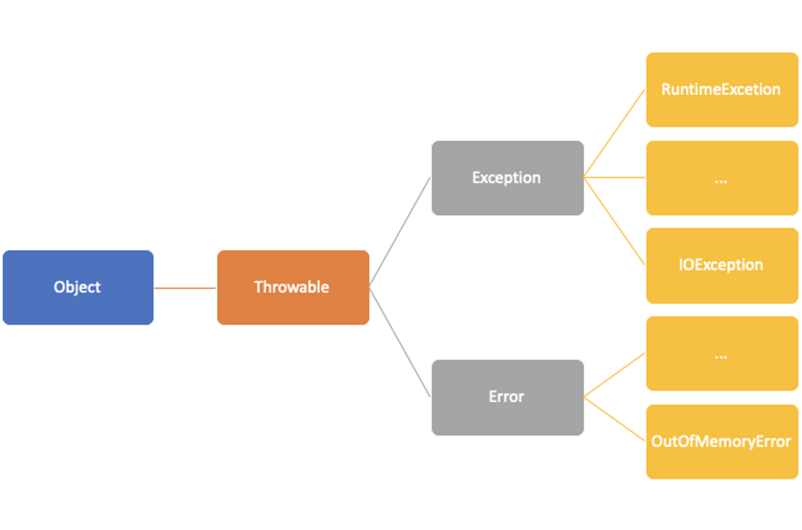
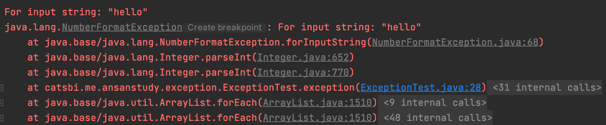
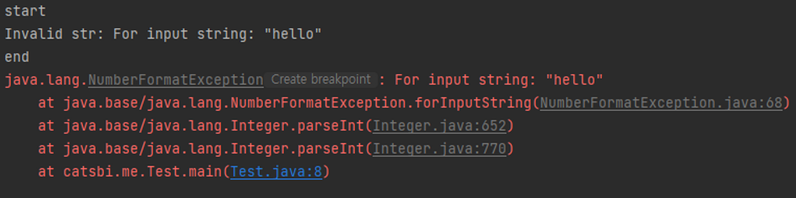

# 예외 처리 (Exception Handling)

## 프로그램 오류
- 프로그램 실행 중 어떤 원인에 의해 프로그램이 해당 상황에 대처를 하지 못할 경우 비정상적으로 종료되거나 에러 팝업창이 뜨는 경우가 있다.
  - 이러한 상황을 프로그램 오류라 한다.

### 발생 시점에 따른 에러 분류
#### Compile Error
- 컴파일 시점에서 발생하는 에러로 소스 코드를 컴파일러가 컴파일하는 시점에서 소스의 오타나 잘못된 구문, 자료형 체크 등 검사를 수행하는데 여기서 발생하는 에러를 컴파일 에러라 한다.
- 이 시점에서 발생하는 문제들을 수정 후 컴파일을 성공적으로 마칠 경우 클래스 파일(*.class) 파일이 생성된다. 

```java
@Test
void compileError() {
    STring helloStr = "hello";

    System.out.println("helloStr = " + helloStr);
}
```
- String을 STring이라 오타낸 코드이다.

#### Runtime Error
- 프로그램 실행 시점에서 발생하는 에러로 컴파일러는 컴파일 시점에서 문법 오류나 오타같은 컴파일 시점에서 알 수 있는 오류는 잡아줄 수 있지만, 실행 중 발생할 수 있는 잠재적인 에러까지 잡을 순 없다. 
- 그래서 컴파일은 문제 없이 완료되어 프로그램이 실행되고 실행 도중 의도치 않은 동작에 대처하지 못해 에러가 발생할 수 있다. 

```java
void stringToInt(String str) {
    int i = Integer.parseInt(str);
    System.out.println("str parsing result = " + i);
}
```
- 문자가 숫자 형태가 아닌 문자 타입인 경우 parseInt() 메서드에서 NumberFormatException이 발생할 것이다.

##### 런타임 시점에서 발생하는 오류는 에러(error)와 예외(exception)으로 나뉜다.
- 에러(Error): 메모리 부족(OutOfMemoryError)이나 스택 오버플로우(StackOverflowError)와 같이 일단 발생하면 복구할 수 없는 심각한 오류
- 예외(exception): 인자값 Null 에러 NPE(NullPointException)같은 발생하더라도 수습이 가능한 덜 심각한 오류. 

#### Logical Error
- 소스 코드 컴파일도 정상적으로 되고 런타임 상 에러가 발생하는 것도 아닌 개발자의 의도와는 다르게 동작하는 에러를 뜻한다.
- 버튼을 클릭하면 팝업이 뜨게 만들었으나 팝업이 아닌 새로운 페이지가 뜨거나 아무 동작을 안하거나 하는 것처럼 의도와는 다르게 동작하는 것을 말한다.

## 예외 클래스의 계층구도
<p align="center"></p>

- 상위 객체인 Throwble을 상속받는 Error와 Exception이 있다. 
- Exception 하위 예외 클래스 중 RuntimeException과 그 하위 예외들은 선택적 예외로 개발자가 상황에 맞춰 대응해주어야 하는 예외이고,
  - 그 외 나머지 예외 클래스와 그 하위 객체들을 필수(checked) 예외라 하여 반드시 체크해주어야 하는 예외이다. 
- RuntimeException 클래스들은 주로 프로그래머의 실수에 의해 발생될 수 있는 예외들이다. 
  - Ex) 배열의 범위를 벗어나거나, 값이 null인 참조 변수의 멤버를 호출하려 하는 경우
- Exception 클래스들은 주로 외부에 영향으로 발생할 수 있는 것들로, 대표적으로 I/O 입출력에 의해 발생하는 경우가 많다. 
  - Ex) 클래스의 이름을 잘못 적거나, 데이터 형식이 잘못되었거나, 사용자가 존재하지 않는 파일명을 입력한 경우

## 예외 처리하기 :: try-catch
- 소스코드를 견고하게 작성함으로써 예외가 줄어들수는 있지만, 프로그래머가 아닌 사용자가 원인으로 발생하는 예외는 줄일 수 없다.
  - 해당 상황에서는 개발자가 미리 대처를 해줄 수 있다.
- 예외 처리(exception handling)란, 프로그래머가 예기치 못한 예외의 발생에 미리 대처하는 코드를 작성하는 것으로, 실행 중인 프로그램의 비정상적인 종료를 막고 정상 상태로 유지하는 것이 목적이다. 
  - 만약 제대로 예외를 처리하지 못한다면 프로그램은 비정상적으로 종료되며,
  - 종료 시점에 처리되지 못한 예외에 대해서 JVM의 예외 처리기(UncaughtExceptionHandler)가 받아서 예외의 원인을 화면에 출력해준다. 

### 예제 코드
```java
@Test
void exception() {
    String str = "hello";

    System.out.println("Integer.parseInt(str) = " + Integer.parseInt(str));
}
```

<p align="center"></p>

- 그래서 이렇게 예외가 발생했을 경우 처리하는 방법으로는 우선 try-catch문이 존재한다.

```java
@ParameterizedTest
@NullAndEmptySource
@ValueSource(strings = {"1", "2", "hello"})
void tryCatch(String str) {
    try {
        // 예외가 발생할 가능성이 있는 코드 작성
        System.out.println("Integer.parseInt(str) = " + Integer.parseInt(str));

    } catch (NumberFormatException e) {
        //NumberFormatException 이 발생했을 경우 catch 문에서 예외를 처리하기 위한 코드
        System.out.println("NumberFormatException = " + e.getMessage());
    } catch (Exception e) {
        //Exception이 발생했을 경우 예외를 처리하기 위한 코드
        System.out.println("e.getMessage() = " + e.getMessage());
    }
}
```

- null, "", "1", "2", "hello"가 각각 매개변수로 들어가서 Int형으로 형변환하는 코드이다.
- try-catch문은 다른 분기문과 다르게 실행할 코드가 한줄이여도 블록({})을 생략할 수 없다.
- try-catch문은 다른 문법처럼 중복으로 블록 내부에 또 try-catch문을 작성할 수 있다. 
- catch문을 통해 예외를 잡아 처리해주지 못한다면, 예외는 처리되지 않는다. 

### 예제
- 다음 코드는 반복문 for문을 통해 순차적으로 배열의 값을 출력하는 코드이다. 하지만, 이 코드는 코드 수행시 에러가 발생한다.

```java
@Test
void arithmeticException() {
    String[] strings = new String[]{"hello", "crong", "coco"};

    for (int i = 0; i < 4; i++) {
        System.out.println(strings[i]);
    }
}
```

- 실행 결과 ArrayIndexOutOfBoundsException 예외가 발생한다.
- 이 코드를 try-catch 문을 사용해 에러가 발생하지 않게 만들어보자. 

```java
@Test
void arithmeticException() {
    //before
    String[] strings = new String[]{"hello", "crong", "coco"};

    try {
        for (int i = 0; i < 4; i++) {
            System.out.println(strings[i]);
        }
    } catch (ArrayIndexOutOfBoundsException e) {
        System.out.println("Empty");
    }
}
```

- 위 코드를 실행하면 에러가 발생하지 않고 범위를 벗어난 주소의 값을 조회하려고 할 경우 catch문에서 해당 예외를 잡아서 Empty 라는 값을 출력하도록 했다. 
- 실행 결과는 hello, crong, coco, Empty 가 순차적으로 출력된다.

## try-catch문에서의 흐름
- 소스 코드의 로직이 수행될 때 try-catch문 내에서 예외가 발생한 경우와 발생하지 않았을 때 흐름이 달라진다. 

### 흐름
- try 블럭 내에서 예외가 발생한 경우
  - 발생한 예외와 일치하는 catch 블럭이 있는 경우
    - 블럭 내의 코드를 수행 후 try-catch문을 빠져나간 다음 해당 구문 다음 문장부터 수행한다.
  - 발생한 예외와 일치하는 catch 블럭이 없는 경우
    - 예외는 처리되지 못하고 종료된다.
- try 블럭 내에서 예외가 발생하지 않은 경우
  - catch문 코드는 수행되지 않으며 try 블럭 내 코드 수행 후 구문을 빠져나가 다음 문장부터 수행한다.

### 코드
```java
@Test
void arithmeticException() {
    String[] strings = new String[]{"hello", "crong", "coco"};

    try {
        System.out.println(strings[0]);
        System.out.println(strings[4]);
        System.out.println(strings[1]);
        System.out.println(strings[2]);
    } catch (ArrayIndexOutOfBoundsException e) {
        System.out.println("Empty");
    }

    System.out.println("end");
}
```

- 코드를 실행하면 처음 strings[0] 출력은 정상적으로 hello가 출력된다.
- 그리고 그 다음 strings[4]의 출력은 존재하지 않는 범위의 값이 아니기 때문에 ArrayIndexOutOfBoundsException 예외가 발생해 catch 블럭 내의 코드가 수행된다.
  - 그 다음 다시 try구문으로 돌아가 코드를 수행하는게 아닌 try-catch 구문을 벗어나 다음 문장이 수행되기에 end가 출력되고 종료된다. 
- 그렇기에 try-catch문을 통해 예측 가능한 예외를 처리해주는 것도 중요하지만 이렇게 예외 발생시 try 블럭내의 나머지 코드들이 수행되지 않는다는 점을 유의해서 코드를 작성해야 한다.

## 예외의 발생과 catch 블럭
```java
try {
  //...
} catch (Exception error) {
	//...
}
```
- catch 블럭은 위와 같이 예외 객체를 매개변수로 받는 괄호 영역과 해당 예외가 매개변수로 들어왔을 경우 수행해야할 로직이 작성된 블럭이 존재한다. 
- 그렇기에 catch문을 작성하려면 예외 타입의 참조변수를 선언해야 한다. 

### 특징
- catch문은 여러 개 작성이 가능하다.
```java
try {
	//...
} catch(NumberFormatException error) {
	//...
} catch(IllegalArgumentException error){
	//...
} catch(ArithmeticException error) {
	//...
}
```

- 첫 번째 catch문부터 instanceof 연산자를 이용해 발생한 예외객체에 사용해서 true가 반환되는 객체가 나올 때까지 검사한다. 

```java
public static void main(String[] args) {
    try{
        System.out.println("start");
        String str = "hello";
        int num = Integer.parseInt(str);

        System.out.println("num = " + num);
    } catch(NumberFormatException error) {
				//...
		} catch(IllegalArgumentException error){
				//...
		} catch(NumberFormatException error){
        System.out.println("Invalid str");
    }

    System.out.println("end");
}
```

- catch문을 모두 순회하면 해당 블럭을 벗어나서 예외 처리는 종료되지만 해당하는 catch 블럭이 없는 경우 예외는 처리되지 않는다. 
- 모든 예외는 Exception 클래스의 자손이기에 catch 블럭 최상단에 Exception을 선언하면 어떤 에러든 해당 catch블럭에서 처리된다. 

### printStackTrace()와 getMessage()
- 예외 발생 시 예외에 대한 정보를 printStackTrace()와 getMessage()를 통해 얻을 수 있다. 
- printStackTrace() 
  - 예외 발생 당시 호출 스택(Call Stack)에 있었던 메서드의 정보와 예외 메세지를 화면에 출력.
- getMessage()
  - 발생한 예외 클래스의 인스턴스에 저장된 메세지를 얻을 수 있다. 

```java
public static void main(String[] args) {
    try {
        System.out.println("start");
        String str = "hello";
        int num = Integer.parseInt(str);

        System.out.println("num = " + num);
    } catch(NumberFormatException error) {
        error.printStackTrace();
        System.out.println("Invalid str: " + error.getMessage());
    }

    System.out.println("end");
}
```

<p align="center"></p>

- getMessage 메서드를 이용해서 해당 로직의 예외 발생 원인을 출력했다. 
- printStackTrace() 메서드를 사용함으로써 프로그램은 예외 처리를 통해 정상적으로 종료되었지만 에러 발생 당시의 호출스택(call stack)에 대한 정보와 예외 메세지를 출력했다. 

### 멀티 catch 블럭
- 여러 catch 블럭을 | 기호를 이용해 합칠 수 있다. 
- 아키텍처를 설계할 때 특정 몇몇 예외에 대해서는 동일한 로직을 수행하게 하고 싶을 때 해당 기호를 사용할 수 있다. 
```java
public static void main(String[] args) {
    Integer ticketPriceDiscount1 = getTicketPriceDiscount("0", 0);
    Integer ticketPriceDiscount2 = getTicketPriceDiscount("hello", 0);
    System.out.println("ticketPriceDiscount1 = " + ticketPriceDiscount1);
    System.out.println("ticketPriceDiscount2 = " + ticketPriceDiscount2);
}

public static Integer getTicketPriceDiscount(String money, int discountPer) {
    Integer ticketPrice=0;
    try {
        System.out.println("start");

        ticketPrice = Integer.parseInt(money)/discountPer;

        System.out.println("ticketPrice = " + ticketPrice);
    } catch(NumberFormatException | ArithmeticException error) {
        error.printStackTrace();
        System.out.println("Invalid str: "+error.getMessage());
    }

    System.out.println("end");
    return ticketPrice;
}
```

- try 내의 로직에서 생길 수 있는 예외가 대표적으로 두 개(NumberFormatException, ArithmeticException)가 있다고 할 때 둘 다 예외 처리를 동일하게 하고 싶다면 위와 같이 코드를 작성하면 된다. 

#### 주의
- 멀티 catch 블럭을 사용할 때 두 예외 클래스가 부모-자식 관계라면 컴파일 시 에러가 발생한다. 
  - 그 이유는 그냥 부모 클래스만 써주는 것과 동일하기 때문이다. 
- 멀티 catch 블럭에서 발생하는 예외는 여러 예외를 처리하기에 발생한 예외가 실제로 어떤 예외인지 알기가 쉽지 않다. 

### 예외 발생시키기
- 프로그래머가 의도적으로 예외를 발생시키는 것 역시 가능하다. 
- throw라는 키워드를 사용하면 되는데, 주로 사용자가 구현하는 비즈니스 로직에서 컴파일의 문법 오류는 없지만
  - 로직 자체가 프로그래머가 의도한대로 진행되는지에 대한 검증(Validation) 로직을 통과하지 못했을 경우 고의로 예외를 발생시켜야 할 때 사용한다. 

#### 사용법
- 발생시키고자 하는 예외를 생성한다. 
  - Exception e = new Exception("고의 발생 예외");
- throw 키워드를 이용해 예외를 발생시킨다.
  - throw e;
- 아니면 바로 new 키워드로 예외 객체를 생성해도 된다. 
  - throw new Exception("고의 발생 예외");

### 메서드에 예외 선언하기
```java
void method() throws Exception1, Exception2, ... ExceptionN {
	//...
}
```
- 메서드 레벨에서 예외를 선언할 수 있다.
- 메서드 레벨에서 선언한 예외와 예외의 자손 타입까지 발생할 수 있다는 걸 의미한다.
  - throws RuntimeException 을 선언할 경우 RuntimeException을 상속하는 하위 예외 객체들 모두 발생할 가능성이 있다.
- 해당 메서드에서 선언한 예외를 보고 블록 내부 로직을 수행하며 해당 예외가 발생할 수 있다고 추측할 수 있고, 이 부분에 대해 유의할 수 있다.
- 예외 처리를 해당 메서드를 호출하는 로직에게 위임할 수 있다. 
  - 예외 던지기

### finally
```java
try {
	// 예외 발생 가능성이 있는 로직
} catch(Exception err) {
	// 예외 처리 로직
} finally {
	// 공통 로직
}
```
- 예외 발생 여부와 상관 없이 무조건 수행되어야 할 로직이 있을 경우 사용하는 블럭
  - 예외가 발생하지 않는다면 try 블럭 이후 finally 블럭이 수행된다.
  - 예외가 발생한다면 try 블럭 내에서 예외가 발생하기 전까지 수행되다가 예외 처리를 위한 catch 블럭이 수행된 후 finally 블럭이 수행된다.
- 사용처로는 커넥션 풀 종료, 임시 파일 삭제, 소켓 종료 등이 있다.

#### 예제 코드
```java
public static void main(String[] args) {
    // TODO Auto-generated method stub
    // creating FileInputStream
    FileInputStream fin = null;
    // creating new file output stream
    FileOutputStream fout = null;
    File file = null;
    Scanner sc;
    try {
        file = new File("Fos.txt");
        file.createNewFile();
        sc = new Scanner(System.in);
        System.out.println("Enter a string  insert into JavaTpoint txt file ------->");
        fout = new FileOutputStream(file);
        //takes an input and covert it into char array.
        char st[] = sc.nextLine().toCharArray();
        for (int i = 0; i < st.length; i++) {//write  a string into the FOs.txt file
            fout.write(st[i]);
        }
        fin = new FileInputStream(file);
        int read;
        // read a string from the Fos.txt file.
        while ((read = fin.read()) != -1) {
            System.out.print((char) read);
        }
        // releases FileOutputStream resources from the streams
        fout.close();
    } catch (Exception e) {
        System.out.println(e);
    } finally {
        try {
            if (Objects.nonNull(fin)) {
                fin.close();
            }
        } catch (IOException e) {
            e.printStackTrace();
        }
    }
}
```
- finally 블럭 내부에 새로운 try-catch 블럭이 추가되어 depth가 2뎁스 이상 늘어났다. 
  - 이는 클린코드 규칙에 벗어나며 리팩토링이 필요하다.

### try-with-resource
- JDK 1.7부터 추가된 기능으로 입출력, 소켓, 커넥션 풀 등 연결/종료가 무조건 한 쌍이 되어야 하는 로직의 경우 유용하게 사용된다. 

#### try-with-resource 이전 코드
```java
try {
	fin = new FileInputStream(file);
} catch(IOException ie) {
	ie.printStackTrace();
} finally {
	try {
      if (Objects.nonNull(fin)) {
          fin.close();
      }
  } catch (IOException e) {
      e.printStackTrace();
  }
}
```
- 1개 이상의 depth block으로 코드의 가독성이 몹시 떨어진다. 

#### try-with-resource 이후 코드
```java
try(fin = new FileInputStream(file)) {
	//...
} catch(IOException e) {
	e.printStackTrace();
}
```
- try 키워드 괄호 내에 객체 생성 코드를 작성하면 해당 객체는 close()를 명시하지 않아도 try 블럭을 벗어나는 순간 자동으로 close()가 호출된다.
- 프로그래머가 명시적으로 닫아주지 않아도 되기에 코드 축소가 가능하다. 

#### 사용 조건
- 해당 객체가 AutoCloseable 인터페이스를 구현해야 한다. 
```java
public interface AutoCloseable {
		void close() throws Exception;
}
```

#### close() 로직에서 예외가 발생한다면?
- try-with-resource에서는 try 괄호 내의 객체 생성 코드를 try 블럭 내부를 벗어나는 순간 자동으로 close()를 호출한다고 했는데 그럼 이 close()에서 예외가 발생한다면 어떻게 될까?
우선, 두 예외가 동시에 발생할수는 없다는 점을 기억해야 한다. 
그렇기에 실제로 발생하는 (try 블럭 내부 로직 예외)예외는 정상적으로 출력되고 close()에서 발생하는 예외는 억제된(suppressed) 예외로 실제 발생하는 예외 내부에 포함되어 노출된다.
⇒ 예제 코드
CloseableResource
package test;

public class CloseableResource implements AutoCloseable{
    public void exceptionWork(boolean isException) throws WorkException {
        System.out.println("exceptionWork("+isException+") 호출됨");
        if (isException) {
            throw new WorkException("called WorkException");
        }
    }

    @Override
    public void close() throws CloseException {
        System.out.println("close() 호출됨");
        throw new CloseException("called CloseExceptiond");
    }

}
Java
Exception class
class CloseException extends RuntimeException {
    public CloseException(String message) {
        super(message);
    }
}


class WorkException extends RuntimeException {
    public WorkException(String message) {
        super(message);
    }
}
Java
테스트 로직 코드
package test;

public class TestApplication {
    public static void main(String[] args) {
        try (CloseableResource cr = new CloseableResource()){
            cr.exceptionWork(false);
        } catch (WorkException we) {
            we.printStackTrace();
        } catch (CloseException ce) {
            ce.printStackTrace();
        }

        System.out.println();

        try (CloseableResource cr = new CloseableResource()){
            cr.exceptionWork(true);
        } catch (WorkException we) {
            we.printStackTrace();
        } catch (CloseException ce) {
            ce.printStackTrace();
        }
    }
}
Java
실행 결과

사용자 정의 예외 만들기
대부분의 예외는 Exception과 RuntimeException 으로부터 파생되는 하위 예외 객체들이다. 
그렇다보니 기본적으로 제공되는 예외 외에 개발자가 구현하는 의미있는 비즈니스 로직상 발생하는 몇몇 예외는 개발자가 직접 예외 객체를 정의해서 발생시킬수도 있다. 
예를들어, 숫자가 10을 넘을 경우 발생하는 예외를 만들어야 한다고 해보자. 
class TenOverException extends RuntimeException {
	//...
}
Java
이렇게 RuntimeException을 상속하는 사용자 정의 예외 객체를 만들면 프로젝트 런타임시 비즈니스로직에서 예외가 발생할 경우 해당 예외를 발생시킬 수 있다. 
(위에서 테스트한 WorkException도 사용자 정의 예외 객체다.)
예외 되던지기(exception re-throwing)
예외를 의도적으로 자신을 호출한 로직에서 처리하게끔 되던지는 기능
특정 로직에서 특정 예외를 공통으로 처리하고자 할때 사용할 수 있다. 
⇒ 사용 예) Scanner 예외 IOException 공통 처리, 숫자 연산 예외 기본값 기본 처리
예제 코드
public static void main(String[] args) {
        try{
            Scanner sc = new Scanner(System.in);
            int i = getInteger(sc);
            double d = getDouble(sc);
        }catch(NumberFormatException err){
            err.printStackTrace();
        }
    }

    private static double getDouble(Scanner sc) {
        try{
            System.out.println("입력");
            String line = sc.nextLine();
            return Double.parseDouble(line);
        }catch(NumberFormatException ne){
            throw ne;
        }

    }

    private static int getInteger(Scanner sc) {
        try{
            System.out.println("입력");
            String line = sc.nextLine();
            return Integer.parseInt(line);
        }catch(NumberFormatException err){
            throw err;
        }
    }
Java
연결된 예외(chained exception)
특정 예외에서 다른 예외를 발생시키는 것
A예외에서 B예외를 생성해서 예외 던지기를 통해 B예외 처리 블록으로 유도할 수 있다.
연결된 예외를 사용하는 이유
⇒ checked 예외를 unchecked예외로 바꿀수 있게 된다. 즉, Exception 예외 객체를 상속하는 하위 예외 객체들을 RuntimeException으로 감싸서 unchecked 예외로 만들 수 있는데, 이 기능을 사용해 더 이상 억지로 try-catch로 처리해줄 필요가없어진다. 
사용법
1.
연결할 새로운 예외객체를 생성한다. 
2.
새로운 예외객체에 initCause 메서드에 인자값으로 기존 연결 될 예외객체를 넣어준다.
⇒ initCause는 Throwable 객체에 정의되어있어서 어떤 예외든 사용이 가능하다.
3.
throw 키워드로 연결 할 예외 객체를 던진다. 
예제 코드
try{
    startInstall();
    copyFiles();
}catch(SpaceException ex){
    InstallException ie = new InstallException("설치중 예외 발생");
    ie.initCause(ex);
    throw new RuntimeException(ie);
}
/*catch (MemoryException me){
    //....
}*/
Java
⇒ MemoryException은 checked 예외이기에 무조건 처리를 해줘야한다.
하지만, 용량 부족 예외는 사실상 코드에서 어떻게 처리할 수 없기에 의미없는 catch 블럭이 되는데, 이를 RuntimeException으로 wrapping함으로써 unckecked 예외가 되어 불필요한 catch 블럭을 삭제할 수 있다. 
